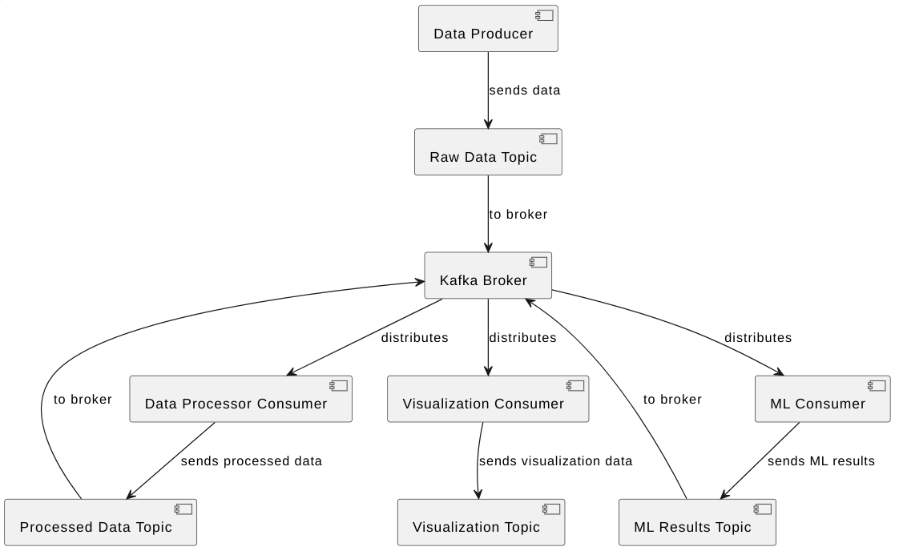

# Kafka driven Real-Time Visualization of Image Classification by resnet50

This repository is a solution to the problem of classifying an images by resnet50 using Kafka.

## Architecture

There are such consumers and producers:
**RawDataProducer**
**DataPreprocessConsumer**
**DataPreprocessProducer**
**MLProcessConsumer**
**MLProcessProducer**
**VisualizationConsumer**



## Simulate data collection

To simulate data collection, the [intel-image-classification](https://www.kaggle.com/datasets/puneet6060/intel-image-classification/code) dataset was used.

Repository already containing dataset, so you only need to clone and launch.

## Installation

Clone the repository:

```
git clone https://github.com/wityat/kafka-lab/
```

Then run docker-compose:

```
docker-compose up
```

That is all! 
